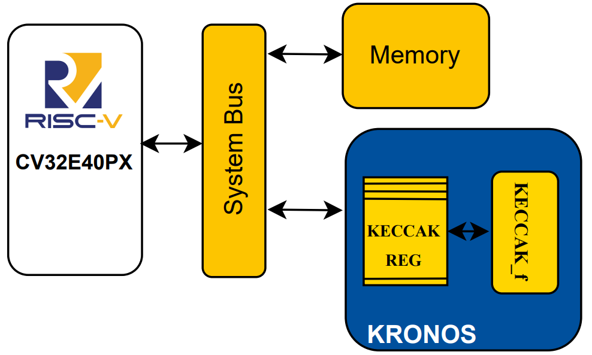

# KRONOS – Loosely-Coupled Integration

## Overview

The integration methodology can significantly affect the performance of dedicated accelerators. This project explores this aspect using **Keccak**, a pivotal hashing standard in **Post-Quantum Cryptography (PQC)**, as a case study.

This branch implements the **loosely coupled** version of KRONOS (Keccak RISC-V Optimized eNgine fOr haShing). The accelerator is integrated as a **memory-mapped component**, accelerating the complete Keccak-*f* permutation.

Fifty additional 32-bit registers (`Keccak Reg`) are used to store the internal state, significantly reducing the number of load/store operations between memory and the accelerator. A dedicated driver, which leverages the **X-HEEP DMA**, is responsible for interfacing with KRONOS and triggering the computation when needed.

  
*Figure: Loosely coupled integration scheme of the KRONOS accelerator.*

## Directory Structure

- `loosely/` → Loosely-coupled integration branch.
- Driver path:  
  `/home/alessandra.dolmeta/HORCRUX/ref/KRONOS/sw/external/lib/drivers/keccak/keccak_driver.c`

## Getting Started

Once you have cloned the repository and switched to the `loosely` branch, you can build and simulate with:

```bash
make mcu-gen
make questasim-sim
```

## Running Applications

To run Keccak or SHA3-384 tests:
```bash
make app-(name) TESTS=(name)
make run-(name) TESTS=(name)
```
Replace (name) with one of the following options:
- keccak — to run the Keccak-f permutation test
- SHA3-384 — to run the SHA3-384 hashing test

## Notes
- This branch does not require running make x_heep-sync. That command is only necessary in the tightly and coprocessor branches.
- The Keccak driver used in this setup is located at:
  `/home/alessandra.dolmeta/HORCRUX/ref/KRONOS/sw/external/lib/drivers/keccak/keccak_driver.c`
- It leverages the DMA engine of the X-HEEP platform to handle data transfers efficiently between the processor and the accelerator.