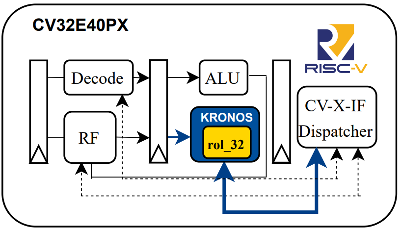

# KRONOS – Tightly-Coupled Integration

## Overview

The integration methodology can significantly affect the performance of dedicated accelerators. This project explores this aspect using **Keccak**, a pivotal hashing standard in **Post-Quantum Cryptography (PQC)**, as a case study.

This branch implements the **tightly coupled** version of KRONOS (Keccak RISC-V Optimized eNgine fOr haShing), leveraging the **CV-X-IF interface** to implement **RISC-V-compliant custom instructions**. These instructions conform to the standard RISC-V format: two source registers and one destination register, ensuring full compatibility with the scalar register file.

Since Keccak was originally designed for 64-bit architectures, the implementation is adapted to operate efficiently on **32-bit systems**. One of the critical components enabling this efficiency is the bitwise rotation operation. To support this, a dedicated `rol_32` instruction has been introduced. It performs efficient 64-bit rotations by operating directly on **pairs of 32-bit registers**, significantly improving the performance of the permutation rounds.

  
*Figure: Tightly coupled integration scheme of the KRONOS accelerator.*


## Getting Started

After cloning the repository and checking out the `tightly` branch, build and simulate using:

```sh
make mcu-gen
make x_heep-sync
make questasim-sim
```

## Running Applications

You can run applications using either the optimized or original Keccak-SHA3-384 flow.

```sh
make app-optimized-SHA3-384 ACC=optimized TESTS=SHA3-384 
make run-optimized-SHA3-384 ACC=optimized TESTS=SHA3-384 
```

```sh
make app-original-SHA3-384 TESTS=KECCAK ACC=original
make run-original-SHA3-384 TESTS=KECCAK ACC=original
```

## Notes
- This version uses custom instructions implemented through the CV-X-IF interface.
- The rol_32 instruction is a key enabler for efficient bitwise operations across 64-bit Keccak lanes on 32-bit hardware.
- The integration ensures minimal data movement overhead by tightly coupling the permutation logic to the RISC-V execution pipeline.
- Unlike the coprocessor version, all Keccak-related instructions operate directly on the scalar register file, maintaining ISA compatibility.
- The tightly coupled design offers a strong tradeoff between performance and hardware complexity, and demonstrates the feasibility of efficient post-quantum hashing in constrained environments.

