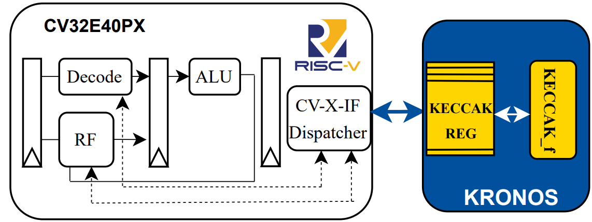

# KRONOS – Coprocessor Integration

## Overview

The integration methodology can significantly affect the performance of dedicated accelerators. This project explores this aspect using **Keccak**, a pivotal hashing standard in **Post-Quantum Cryptography (PQC)**, as a case study.

This branch implements the **coprocessor-based** version of KRONOS (Keccak RISC-V Optimized eNgine fOr haShing). As in the loosely-coupled approach, the complete Keccak-*f* permutation is performed. However, in this version, the **CV-X-IF interface** facilitates communication between the accelerator and the RISC-V core.

Three **R-type custom instructions** are used to:

- Load the internal Keccak state from memory into a dedicated `Keccak Reg` register file
- Start the 24-round permutation
- Store the result back into memory

Unlike the Instruction Set Extension (ISE) approach, this version is **not fully compliant** with the RISC-V ISE specification, but still achieves tight integration with custom instruction semantics.

  
*Figure: Coprocessor-based integration scheme of the KRONOS accelerator.*

## Getting Started

After cloning the repository and checking out the `coprocessor` branch, build and simulate using:

```sh
make mcu-gen
make x_heep-sync
make questasim-sim
```

## Running Applications

You can run applications using either the optimized or original Keccak-SHA3-384 flow.

```sh
make app-optimized-SHA3-384 ACC=optimized TESTS=SHA3-384 
make run-optimized-SHA3-384 ACC=optimized TESTS=SHA3-384 
```

```sh
make app-original-SHA3-384 TESTS=KECCAK ACC=original
make run-original-SHA3-384 TESTS=KECCAK ACC=original
```

## Notes
This version uses custom instructions implemented through the CV-X-IF interface.

- It is tightly integrated into the processor pipeline but not fully RISC-V ISE-compliant.
- The driver code is designed to abstract the instruction interface and provides a software-friendly API.
- The Keccak Reg file holds the full 1600-bit internal state using 50 32-bit registers.
- The accelerator executes the full Keccak-f permutation autonomously once triggered.

